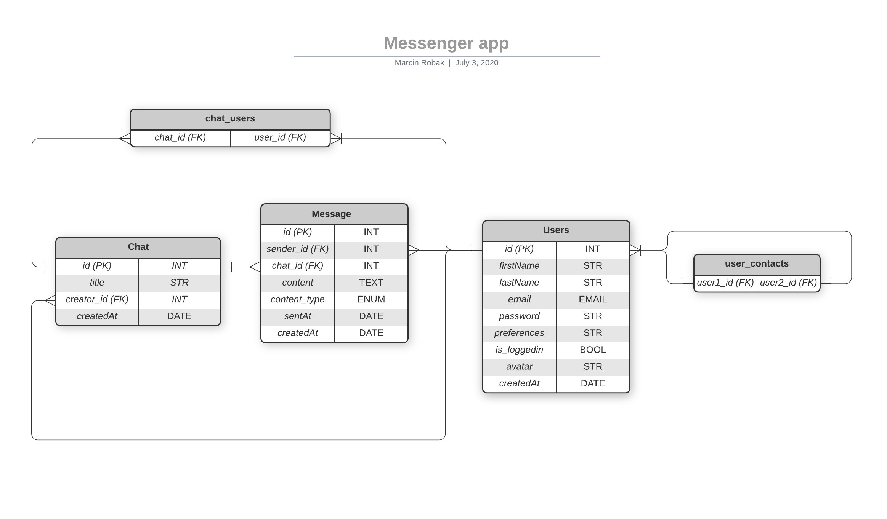

# Messenger app - React Native project

This app was build as a finishing portfolio project for Codaisseur Academy. My decision to build interactive, lightweight mobile app was to showcase my skills as an React Native developer and to solidify and expand my understanding of used technologies.


---

1. [Learning goals:](#learning-goals-)
2. [Follow project progress here:](#follow-project-progress-here-)

   - [Client](#client)
   - [Backend](#backend)

3. [Data model:](#data-model-)
4. [Technology used”](#technology-used-)
5. [Overview of the features _(with pull requests)_](#overview-of-the-features---with-pull-requests--)

6. [Installation guide](#installation-guide)

---

## Learning goals:

- Gain experience in React Native framework
- Learn new UI frameworks
- To gain more experience using GraphQL:

  - setting up schemas and resolvers
  - queries and subscriptions

- Learn animations as a part of UX

---

## Follow project progress here:

### Client

#### Repo:

[https://github.com/mr-robak/messenger-client](https://github.com/mr-robak/messenger-client)

#### Project board:

**[https://github.com/mr-robak/messenger-client/projects/1](https://github.com/mr-robak/messenger-client/projects/1)**

### Backend

#### Repo:

[https://github.com/mr-robak/messenger-backend](https://github.com/mr-robak/messenger-backend)

#### Project board:

**[https://github.com/mr-robak/messenger-backend/projects/1](https://github.com/mr-robak/messenger-backend/projects/1)**

---

## Data model:



---

## Technology used”

- React Native
- Apollo CLI
- GraphQL - queries - subscription/websockets

- PostgreSQL
- Apollo Server with Node Express Server

---

## Overview of the features _(with pull requests)_

## Installation guide

1. Clone the app

```
git clone git@github.com/mr-robak/messenger-backend.git
```

2. cd into your project

```
cd YOUR_PROJECT_NAME
```

3. install dependencies

```
npm install
```

4. start server

```
npm run dev
```

5. Start with

```
npm start
```
